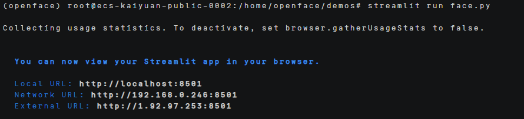

# OpenFace部署指南


## ‌一、环境准备


### 更新系统


#### EulerOS2.0


```
yum -y update  
yum -y upgrade
```


#### Ubuntu 24.04


```
apt-get -y update
export DEBIAN_FRONTEND=noninteractive
apt-get -y -o Dpkg::Options::="--force-confold" dist-upgrade
```


## **二、安装conda**


```
mkdir -p ~/miniconda3

wget https://repo.anaconda.com/miniconda/Miniconda3-latest-Linux-aarch64.sh -O ~/miniconda3/miniconda.sh

bash ~/miniconda3/miniconda.sh -b -u -p ~/miniconda3

rm -f ~/miniconda3/miniconda.sh

source ~/miniconda3/bin/activate

conda init --all
```


创建虚拟环境

```
conda create -n openface python=3.10
```

## **三、源码下载**

### **1.下载openface的源码**

```
git clone https://github.com/cmusatyalab/openface.git

sudo yum install cmake

sudo apt install build-essential cmake libopenblas-dev liblapack-dev

sudo apt update

sudo apt install cmake -y

pip install -r requirements.txt -i https://pypi.tuna.tsinghua.edu.cn/simple

pip install streamlit opencv-python numpy scikit-learn pillow -i https://pypi.tuna.tsinghua.edu.cn/simple

pip install face_recognition==1.3.0 -i https://pypi.tuna.tsinghua.edu.cn/simple

conda install -c conda-forge openblas  

conda install -c conda-forge dlib

conda install -c conda-forge libstdcxx-ng

pip install torch torchvision torchaudio --index-url https://download.pytorch.org/whl/cpu -i https://pypi.tuna.tsinghua.edu.cn/simple
pip install facenet_pytorch -i https://pypi.tuna.tsinghua.edu.cn/simple
```

2.下载权重文件

```
cd /home/openface/models/dlib

wget http://dlib.net/files/shape_predictor_68_face_landmarks.dat.bz2

bunzip2 shape_predictor_68_face_landmarks.dat.bz2

cd /home/openface/models/openface

wget https://storage.cmusatyalab.org/openface-models/nn4.small2.v1.t7
```

 

3.下载数据集

下载lfw数据集，然后上传到ecs中

```
tar -xvzf yourfile.tgz

python class.py \

 --workDir /home/openface/data/lfw_ \

 --classifierOut /home/openface/models/lfw_class.pkl
```

## **四、启动项目**

### **1.修改代码**

[train_lfw.py](../scripts/train_lfw.py) #lfw训练代码
 

[face.py](../scripts/face.py) #人脸识别代码
 

 

### **2.运行实现**

```
conda activate openface

cd /home/openface/demos

python train_lfw.py  #训练lfw数据集
```

 

```
streamlit run face.py
```



运行之后会显示为这个，然后使用https://ip+8501打开网页

 


然后在网页导入要进行人脸识别的图片，就能获得预测结果。


